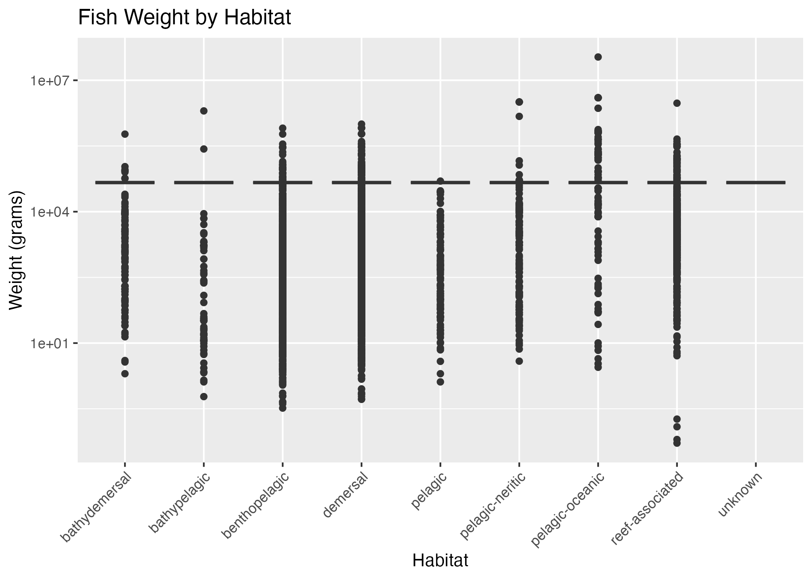

# 🐟 Fish Species Analysis Project

Welcome to the **Fish Species Analysis** Project:
— a multi-tool exploration of global fish traits using data from [FishBase](https://www.fishbase.se/)
— showcases skills in data wrangling, visualization, modeling, and dashboarding using **R, Python, SQL,** and **Tableau**

---

## 🔍 Overview

Ecological and biological data, courtesy of FishBase, is leveraged to analyze species traits (habitat, weight, length, etc.) to reveal patterns in morphology, conservation status, and much more!

---

## 💻 Tech Stack

- **R**: Data extraction via `rfishbase`, data cleaning (`dplyr`, `tidyr`), visualizations (`ggplot2`), modeling (`lm`)
- **Python**: Data analysis (`pandas`), exploratory charts (`matplotlib`, `seaborn`), cross-validation -- IN PROGRESS
- **SQL**: Structured relational schema for cleaned data (PostgreSQL / SQLite compatible)
- **Tableau**: Interactive dashboard for trait filtering and comparison -- IN PROGRESS

---

## 📷 Sample Visualization

### 📊 Fish Weight by Habitat

---

## 👀 Sample SQL View

### 🔍 Model Prediction Summary View

This [CSV summary](data/view_length_summary.csv) compares actual vs predicted fish lengths, including model error and species information.

#### ➡️ Here are the top 5 rows of the view:

|   actual_length |   predicted_length |   error | Genus             | Species                    |
|-----------------|--------------------|---------|-------------------|----------------------------|
|            3.08 |            8.22831 |    5.15 | Aapticheilichthys | Aapticheilichthys websteri |
|          130    |          157.597   |   27.6  | Aaptosyax         | Aaptosyax grypus           |
|           11.5  |            8.22831 |   -3.27 | Abactochromis     | Abactochromis labrosus     |
|           32.5  |           42.2217  |    9.72 | Abalistes         | Abalistes filamentosus     |
|           60    |           73.3065  |   13.31 | Abalistes         | Abalistes stellatus        |

